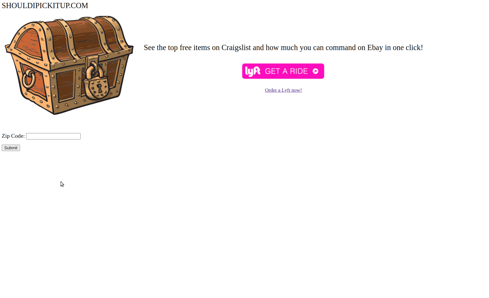

# Given a free listing on Craiglist, should I pick it up?  

- Query the site with your zipcode and the site return free items in your area.
- Data pulled from Craiglist and Matched with Ebay.
- The decision to pick it up or not is ultimately yours.

NOTES:
 - This project is intentionally "in progress".
 - It serves for inspiration for anyone to learn Python, Flask, MongoDB, Devops principles.
 - And for fun. Feedback or Collaborators Welcome.
 - Shout out to [Gary V](https://www.instagram.com/p/B5ghkSqAduP/)

## Web Site -- Peek Screen Gif



## Installing
```
git clone https://github.com/jouellnyc/shouldipickitup.git
cd shouldipickitup
docker-compose  up -d
```

## Architechure
- Nginx will listen on the local host's port 80
- Flask and Mongodb will listen on port 8000 and 27017 respectively of the Docker Containers only
- All 3 will be on the same 'bridged' docker network reachable by docker 'names'

## Requirements
git/docker/docker-compose

## Meta
John Ouellette – [@jjouell](https://twitter.com/jjouell) – twitter[1:]@gmail.com

## Contributing

1. Fork it.
2. Create your feature branch (`git checkout -b feature/fooBar`)
3. Commit your changes (`git commit -am 'Add some fooBar'`)
4. Push to the branch (`git push origin feature/fooBar`)
5. Create a new Pull Request

## Future work 

High Level Command line Usage example with Lyft Integration

```
In [21]: %run craigs_lyft_ebay.py
"Dish Drying Rack" is Free on Craigslist, is selling for $14.99 on Ebay and is 0.46 miles away from you.
 Using Lyft it will cost between 9.0 and 12.0 dollars to pick up.
